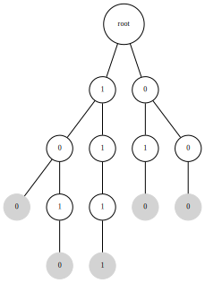

# Binary Dictionary
This class stores binary strings using a prefix/trie data structure.  Binary 
strings contain only the characters "0" or "1".  For example, the class 
stores the binary strings "100", "010", "1111", "1010", "000" using the 
following prefix tree:

